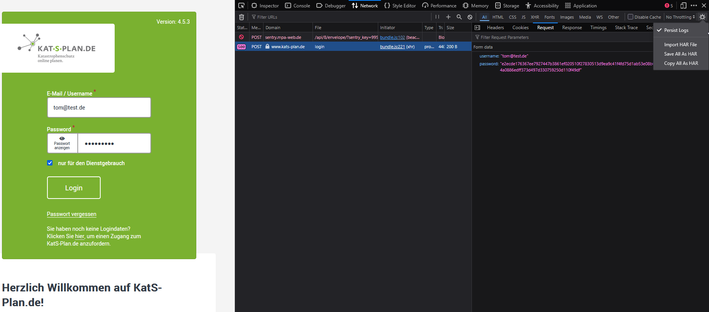

## Downloader für [kats-plan.de](https://www.kats-plan.de/)
Dieses Tool läd alle inhalte (für die der angegebene User Berechtigungen hat herunter und bietet die Inhalte durch einen lokalen Webserver zum Anzeigen an)
Das docker-compose File definiert 2 Container. Der "downloader" Container wird gestartet, läd die Inhalte von katsplan herunter und beendet sich anschließend.
Der apache Container stellt auf port 8001 einen Webserver bereit, der die heruntergeladenen Inhalte anbietet.

### Installation
Die installation ist denkbar einfach.
- git clone https://github.com/commandnet/katsplandownloader.git
- cd katsplandownloader
- mv env-example .env
- .env bearbeiten
- docker-compose up -d
- http://serverip:8001 aufrufen und benutzen

### Passwort
kats-plan.de überträgt das Benutzerpasswort "verschlüsselt", das verschlüsselte Passwort lässt sich am einfachsten mit der Firefox Entwickler Konsole auslesen.
Hierzu die Loginseite von kats-plan.de/ORGANISATION aufrufen und mit F12 die Entwickler Konsole öffnen. Dann Persistent Logs einschalten und einmal einloggen.
Anschließend kann man im Request das verschlüsselte Passwort einsehen.

